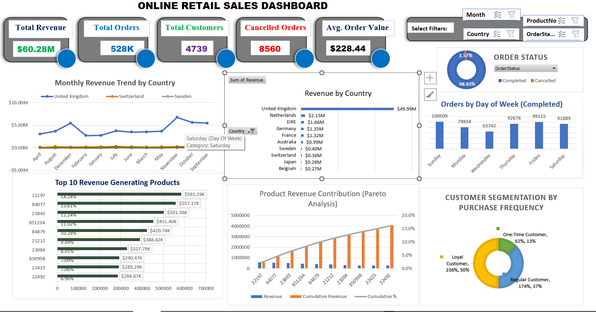

# Online Retail Sales Dashboard (Excel)

## Table of Contents 
- [Project Overview](#project-overview)
- [Data Sources](#data-sources)
- [Business-Recommendations](Business-Recommendations)
## Project Overview
This project analyzes an online retail dataset to identify sales trends, product performance, and customer purchasing behavior.

The analysis was performed using Microsoft Excel with pivot tables and an interactive dashboard.

## Data sources
Sales Transaction: The primary dataset used for this analysis is the "Sales_Transactions.csv" file, containing detailed information about each sale and transaction made by customers.

## Tools Used
- Microsoft Excel
- Pivot Tables
- Data Visualization

## Key Business Questions
• How much revenue is the business generating?
• Which products contribute the most revenue?
• When are customers most likely to place orders?
• Which countries generate the most sales?
• What type of customers purchase most frequently?

## Data Preparation
The dataset was cleaned and structured in Excel to ensure accuracy before analysis.

Key steps included:
• Removing missing values and duplicate records
• Creating a Revenue column (Quantity × Price)
• Creating a Day of Week column for behavioral analysis
• Creating Order Status categories (Completed vs Cancelled)

## Key Metrics
Total Revenue: $60.28M  
Total Orders: 528K  
Total Customers: 4,739  
Average Order Value: $228.44

## Key Insights
1. Strong Revenue Performance
The business generated $60.28M in revenue from 528K orders, with an average order value of $228.44.

2. High Order Completion Rate
Over 98% of orders are successfully completed, indicating efficient order processing and strong customer satisfaction.

3. Revenue Concentration in the UK Market
The United Kingdom contributes the majority of total revenue ($49.99M), significantly outperforming other markets.

4. Weekend Purchasing Behavior
Order volume peaks Thursday through Sunday, with Sunday generating the highest number of completed orders.

5. Product Revenue Concentration
Pareto analysis shows that a small number of products generate a large share of revenue, confirming the 80/20 rule.

## Business Recommendations
• Prioritize inventory and marketing for the top revenue-generating products
• Increase marketing campaigns before weekend peak purchasing days
• Expand growth efforts in international markets outside the UK
• Develop loyalty programs to further strengthen repeat purchasing behavior

## Dashboard

## Files in This Repository
- Excel dashboard file
- Dashboard screenshot
- Portfolio case study
- 
## Conclusion
This analysis provides a comprehensive view of retail sales performance and highlights opportunities to improve product strategy, customer retention, and international market growth.

